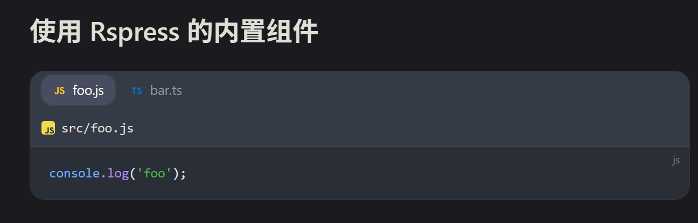
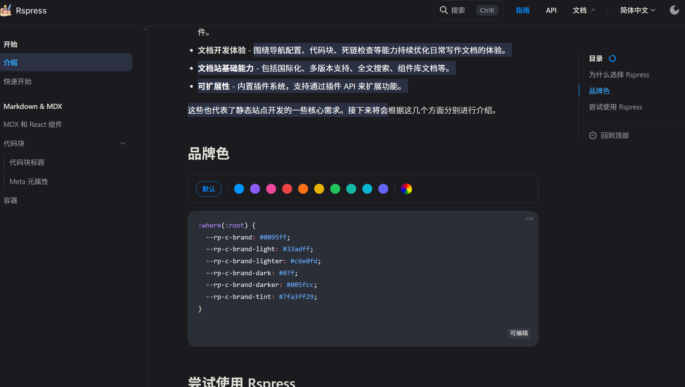

# Rspress 自用构建模板

## 介绍

### 1. 添加代码块小图标 

只利用 `less` 和 `wrap` 实现了代码块小图标功能



并且使用 `less` 添加小图标非常简单
```less
.rp-codeblock__title{
  // 针对代码块 title 添加图标
  #set-icon.lang(js; var(--icon-js));
  #set-icon.lang(ts; var(--icon-ts));
  // 针对 Tabs 中的代码块 title 添加图标
  #set-icon.tab-lang(js; var(--icon-js-path));
}
```
### 2. 样式大修

参考了 **vitepress** 的样式，并做了一些颜色修改，更加舒适



### 3. 把 **vitepress** 的动画按钮借鉴过来了嘻嘻


### 3. 移动端菜单栏改为黏滞定位，滑动时隐藏导航栏

### 4. 修复主题无法切换至 auto 的问题

### 5. 为部分组件添加出场过渡动画，舒服

### 6. 等等一系列小改动...


## 安装

下载依赖:

```bash
npm install
```

## 开始

启动 Dev 开发服务:

```bash
npm run dev
```

为生产构建网站:

```bash
npm run build
```

在本地预览生产构建:

```bash
npm run preview
```
